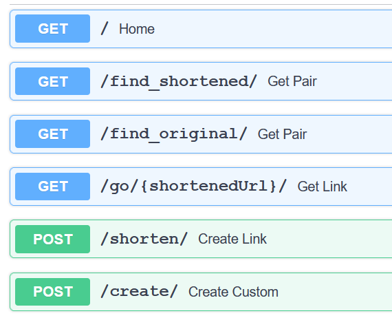
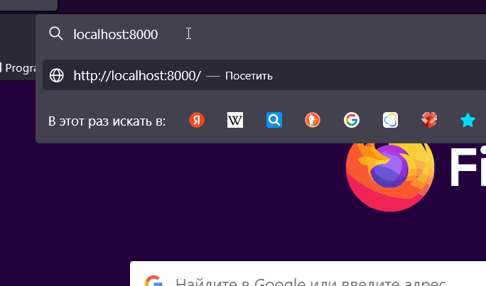

# URL shortener made using [FastAPI](https://fastapi.tiangolo.com/)

## Features
- Shortening a URL;
- Searching a URL by a short version and vice versa;
- Creating a custom contraction specified by a user.

## Installation
The application exposes API to use via 
a CLI tool or a Swagger interface. 
### Prerequisites
- [python](https://www.python.org/)
- [poetry](https://python-poetry.org/) - a python packaging and dependency management tool to use instead or alongside with *pip*

### How to install 
1. Clone the repository.

```
git clone https://github.com/qracer/fastapi-shortener-api.git
```

2. Install dependencies.

```
poetry install
```

3. Open **a new terminal screen** to start a server and type following commands.

```
poetry shell
python server.py
```

4. In the main terminal screen use *cli.py* to communicate with the running server.

```
python cli.py -h
python cli.py -f https://cnn.com/
python cli.py -u 9h12gha3
python cli.py -s https://dw.com/
python cli.py -c https://hbo.com/ hbolink
```

### Usage

As was mentioned above the server (and API correspondingly) could be used via the cli tool - cli.py.

Since the application is made with the FastAPI framework API could be accessed via a swagger interface. To use that open the link localhost:8000/docs in your browser. 



Redirection can be checked in a browser respectively.

